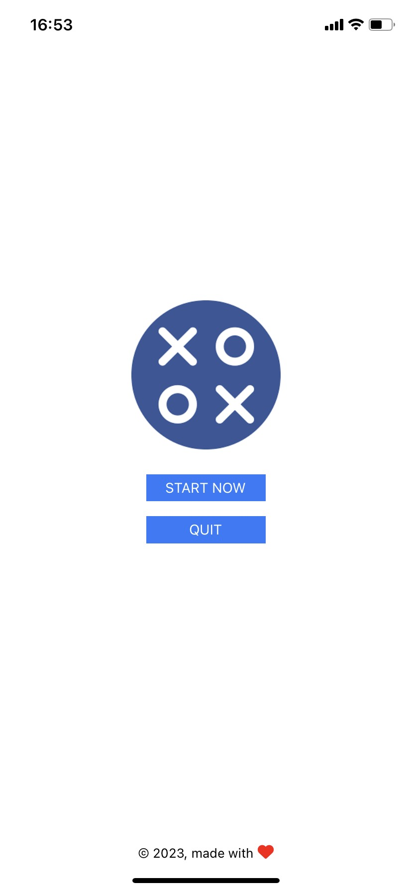
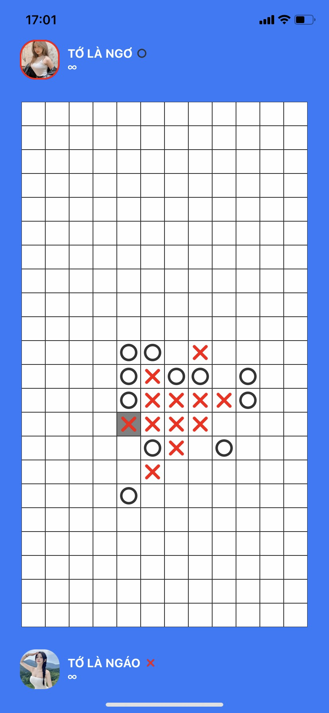

# CARO
Game Caro using ReactNative

## Required
- NodeJS
- Expo App + Access the same local network (Scan QR)
- SDK (Simulator Android or Device real)
- MacOS and XCode (Simulator iOS)

## Install and Run
#### Step 1
```
npm i
```
#### Step 2
```
npx expo start
```
#### Step 3
- Scan QR or use simulator, device real to run app

## Image Project Demo



# Goodluck!